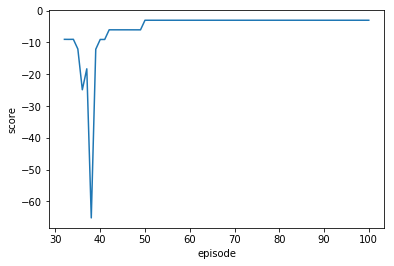

# Teach a Quadcopter How to Fly

This project is one of the requirements for Udacity's machine learning nanodegree.
The goal was to use a reinforcement learning algorithm to teach a quadcopter drone
to perform a task with minimal error.  The task I gave to the drone was to take off
from the ground at zero initial velocity obtaining a hovering position with x, y, and
z coordinates respectively 10, 10, and 20.  I used the Keras DDPG actor-critic deep learning
code provided by Udacity with some modifications and I adjusted various parameters to optimize
my results.  The Quadcopter_Project.html contains my results.  I found that adding batch normalization,
droput, or lowering the default learning rate in the DDPG model did not improve my result.  However,
adding some regularization to the dense layers of the neural net and doubling the batch size improved
my results.  I also adjusted other parameters.  See agents/agent.py and Quadcopter_Project.html
for more information. The reward function I used in task.py was equal to 1 - 0.2*(|10 - x| - |10 - y| - |10 - z|).
The graph of score which counts the total rewards in each learning episode (the sum of rewards for each step
taken by the drone) versus episode is shown in the following graph. 

